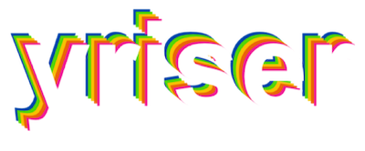
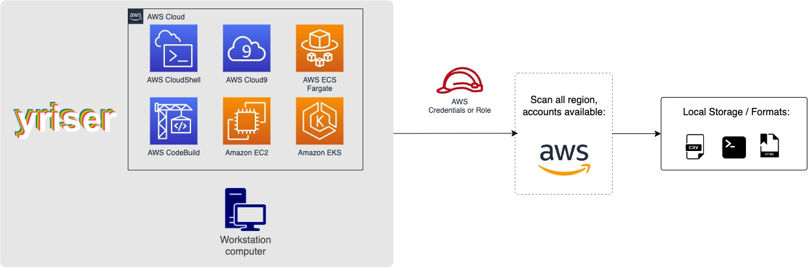
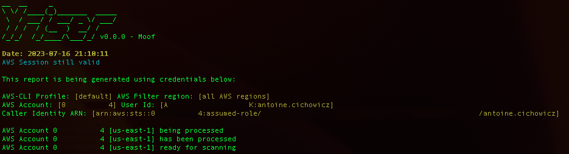

<p align="center">
  
</p>

<p align="center">
	<a href="https://github.com/yris-ops/yriser"></a>
  <a href="https://github.com/yris-ops/yriser/issues"></a>
  <a href="https://github.com/yris-ops/yriser/releases"></a>
  <a href="https://github.com/yris-ops/yriser/releases"></a>
	<a href="https://github.com/yris-ops/yriser"></a>
  <a href="https://github.com/yris-ops/yriser"></a>
</p>

<p align="center">
	<a href="https://join.slack.com/t/yrisgroupe/shared_invite/zt-1q51z8dmv-GC0XzUSclzBnUQ0tpKhznw"></a>
	<a href="https://twitter.com/cz_antoine"></a>
	<a href="https://www.linkedin.com/in/antoine-cichowicz-837575b1"></a>
</p>

## Description

**Yriser** is an Open Source FinOps tool to perform AWS tagging best practices, tagging strategy, continuous adjustments in cloud optimization.

**Yriser** will help you answer these questions:

* How are tags enforced and what methods and automation will be used (proactive vs reactive)?
* How are tagging effectiveness and goals measured?
* How often should the tagging strategy be reviewed?
* Who drives improvements? How is this done?

## 📃 Documentation

The full documentation can be found at [https://www.docs.yriser.com](https://www.docs.yriser.com)

## 🚀 Quick Start

Yriser has been written in Shell using the `jq`, `bc` and AWS CLI.

### From Github

Once Yriser repository is cloned, get into the folder and you can run it:

*Commands:*

``` shell
cd yriser
```

### Configuration file 

Edit the configuration file 

``` shell
vi config.txt
```

Below `## TAG KEY` and between `## TAG VALUE` place your tag keys. 

Below `## TAG VALUE` and between `## END` place your tag values.

### Start

Once Yriser repository is cloned, get into the folder and you can run it:

``` shell
./yriser.sh
```

## 🏛️ High level architecture

You can run Yriser from your workstation, an EC2 instance, ECS Fargate or any other container, Codebuild, CloudShell, Cloud9 and many more.



## 🏁 Basic Usage

``` shell
./yriser.sh
```



> Running the `yriser.sh` script whitout options will use your environment variable credentials.

By default, Yriser will generate a CSV, HTM reports.

The HTML report will be located in the output directory as the other files and it will look like:


You can always use -h to access to the usage information and all the possible options:

``` shell
./yriser.sh -h
```

More details at [https://www.docs.yriser.com](https://www.docs.yriser.com)

### AWS

You can always use -a to access to the usage information and all the possible options:

``` shell
./yriser.sh -a
```

Use a custom AWS profile with -p and/or AWS regions which you want to audit with -r:

``` shell
./yriser.sh -p custom-profile -r us-east-1 eu-west-1
```

> By default, Yriser will scan all AWS regions.

## Security

See [CONTRIBUTING](CONTRIBUTING.md#security-issue-notifications) for more information.

## License

Yriser is licensed as Apache License 2.0 as specified in each file. You may obtain a copy of the License at <http://www.apache.org/licenses/LICENSE-2.0>