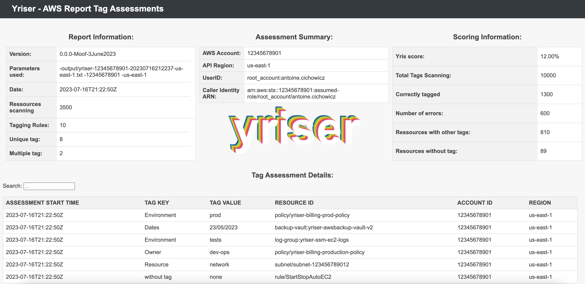

# Reporting

By default, Yriser will generate a CSV and a HTML report

## Output Formats

Prowler supports natively the following output formats:

- CLI
- CSV
- HTML
- JSON

Hereunder is the structure for each of the supported report formats by Yriser:

### HTML

The html report will be located in the output directory as the other files and it will look like:



### CSV

#### Tag Assessment Details:

| ASSESSMENT_START_TIME	| TAG KEY | TAG VALUE | RESOURCE_ID | ACCOUNT_ID | REGION | 
| --------------------- | ------  | ----------| ----------- | ---------- | ------ |

#### Multiple Tag:

| TAG VALUE	| NUMBER |
| ----------| ------ |

### JSON


``` json
[
  {
    "ASSESSMENT_START_TIME": "2023-08-15T05:42:36Z",
    "TAG_KEY": "without tag",
    "TAG_VALUE": "none",
    "RESOURCE_ID": "rule/yriser-rule",
    "ACCOUNT_ID": "1234567890",
    "REGION": "us-east-1"
  },
  {
    "ASSESSMENT_START_TIME": "2023-08-15T05:42:36Z",
    "TAG_KEY": "without tag",
    "TAG_VALUE": "none",
    "RESOURCE_ID": "rule/yriser-policy",
    "ACCOUNT_ID": "1234567890",
    "REGION": "us-east-1"
  }
]
```

Multiple Tag:

``` json
[
  {
    "TAG_VALUE": "Date_list:",
    "NUMBER": null
  }
]
```